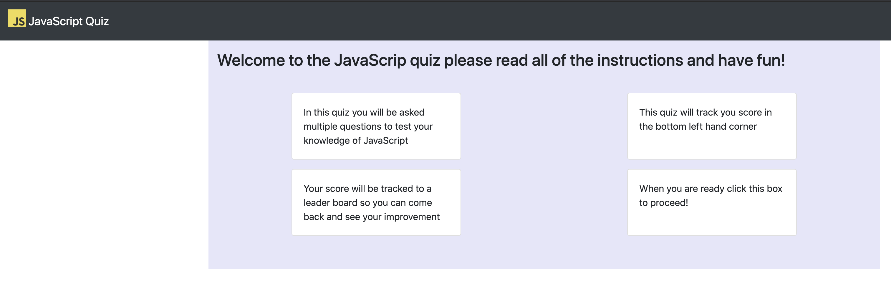

# homework-4-laursen
homework assignment 4 for UofU coding boot camp. JS quiz

this is a quiz application that has a updating high score board

the design of the UI is based on Use to Teach tutorial design

the quiz has a dynamic timer that punishes incorrect answers

the leader board has a limit of ten users and orders them by highest score

