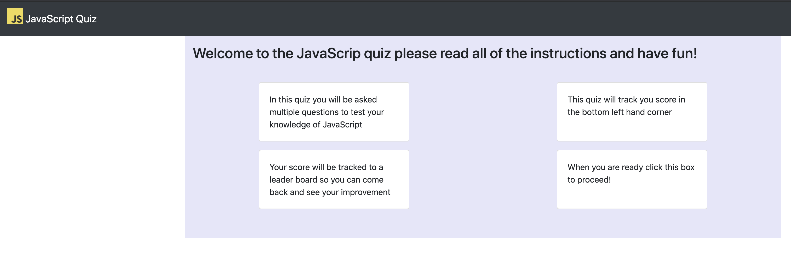

# JS Quiz

## Table of Contents
[Description](#description)  
[Installation](#Installation)  
[Test](#Testing)  
[Project Links](#live-Site-and-Repo)  
[License](#License)  
[Contributors](#Contributors)  

## Description
* Quiz built with JS using a use to teach design. This app uses HTML, CSS, Bootstrap, and Javascript

## Installation
* Use live link

## Testing
* No testing available

## Live Site and Repo
* [live Site](https://ajlaursen.github.io/ajlaursen-js-qiz/)
* [Repo](https://github.com/ajlaursen/ajlaursen-js-qiz)

## License
* 

## Contributors
* Contributor: [Alex Laursen](https://github.com/ajlaursen) Email: [contact@ajlaursen.codes](mailto:contact@ajlaursen.codes)

